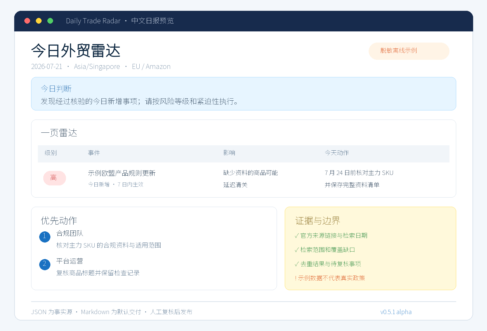

# Daily Trade Radar｜每日外贸雷达

[](https://github.com/NextBeforeAnd/daily-trade-radar/actions/workflows/test.yml)


面向中国外贸企业和跨境电商团队的 Codex Skill：核验官方贸易政策、海关、制裁与出口管制、税费、产品合规、物流和平台规则变化，生成带来源、风险等级和负责人动作的中文日报。重点覆盖 Amazon（亚马逊）、TikTok Shop（TK）、Alibaba.com（阿里巴巴国际站）、AliExpress（速卖通）、Temu、Shopee、Lazada、eBay、Walmart Marketplace、Shopify 和 Jumia。

> 当前开发版本：`v0.5.1`（Alpha）。它是运营研究辅助工具，不替代法律、税务、海关或制裁专业意见；报告发布前必须由业务人员核验关键事实。



[查看完整中文示例](examples/sample-radar.md) · [5 分钟上手](docs/quickstart.md) · [独立 CLI 能力边界](docs/standalone-cli.md) · [命令与高级功能](docs/advanced.md)

## 核心闭环

```text
确定范围 → 检索官方来源 → 人工核验 → 去重与评分 → 中文日报 → 明确负责人动作
```

Daily Trade Radar 将研究过程拆成可审计步骤：

- Codex 负责搜索、浏览和实质性研究；
- Python CLI 负责确定性的规划、公开来源采集、校验、去重、评分、快照和渲染；
- 人工负责确认适用范围、关键日期、义务、税率以及是否发布或发送告警。

## 5 分钟上手

### 在 Codex 中使用

安装 Skill：

```text
Use $skill-installer to install the daily-trade-radar skill from
https://github.com/NextBeforeAnd/daily-trade-radar/tree/main/skill/daily-trade-radar
```

然后直接提出研究任务：

```text
Use $daily-trade-radar to 生成今日中文外贸雷达。
关注欧盟、美国、中国出口管制和 Amazon，引用官方一手来源，
与上一期比较并给出负责人动作。
```

### 使用独立 CLI

```bash
python -m pip install -e "./skill/daily-trade-radar[docx]"
daily-trade-radar init --directory my-radar
daily-trade-radar run --profile my-radar/profile.json
```

第一次运行会生成研究计划并停在 `research_required`。这是正常的安全门：计划或抓取到的页面不能自动变成政策结论。完成一手来源研究并准备好已复核事件后继续：

```bash
daily-trade-radar run --profile my-radar/profile.json --events reviewed-events.json
```

完整步骤和输出说明见 [Quickstart](docs/quickstart.md)。

## 两种运行模式

| 能力 | Codex Skill | 独立 CLI |
|---|---:|---:|
| 搜索网页与交互式浏览 | 支持 | 不支持 |
| 公开 HTTP、RSS、Atom、Sitemap 采集 | 支持 | 支持 |
| 实质阅读、语义研究与事实核验 | Codex + 人工 | 依赖外部输入 + 人工 |
| 研究计划、来源覆盖和健康检查 | 支持 | 支持 |
| 校验、去重、评分和报告渲染 | 支持 | 支持 |
| 已审核报告的历史库与快照 | 支持 | 支持 |
| 无人值守生成可靠政策结论 | 不支持 | 不支持 |

独立 CLI 是完整的确定性处理工具，但不是通用爬虫，也不会替代研究员。详细限制见 [独立 CLI 模式](docs/standalone-cli.md)。

## 默认输出

- UTF-8 JSON：事实和审计信息的唯一数据源；
- 中文 Markdown：默认的人类可读日报；
- DOCX：需要正式流转时可选；
- 来源覆盖 HTML/Markdown/JSON：展示缺口和访问健康度，不代表已完成政策核验。

示例：

```bash
daily-trade-radar validate examples/current.json --require-language zh-CN
daily-trade-radar deduplicate examples/current.json --previous examples/previous.json --output deduplicated.json
daily-trade-radar markdown deduplicated.json --output radar.md
daily-trade-radar coverage-dashboard --format html --output source-coverage.html
```

## 安全边界

- 优先使用官方一手来源，二手来源只能作为线索；
- 报告必须披露检索截止时间、时区、范围和覆盖缺口；
- 登录页面只记录访问结果，不持久化认证页面正文；
- 相似但不确定的事件保留为 `review_required`，不会静默删除；
- 语言不一致可以阻止发布，不自动翻译关键事实；
- webhook 只有在操作者显式传入 `--send-alerts` 时才发送；
- 评分是排序和复核工具，不是法律结论。

## 项目结构

```text
skill/daily-trade-radar/   可安装的 Codex Skill 与 Python 包
examples/                  离线输入、完整中文示例和预览图
docs/                      Quickstart、独立模式和高级功能导航
tests/                     标准库回归测试
.github/workflows/         Python 版本矩阵、Ruff 与覆盖率检查
```

## 高级功能

平台配置、来源健康、历史库、聚焦钻取、校准、评测、Git/S3 快照等能力仍然保留，但不属于第一次运行必须理解的内容。参见：

- [高级功能与命令导航](docs/advanced.md)
- [平台注册表](skill/daily-trade-radar/references/platform-policy-monitoring.md)
- [快照存储](skill/daily-trade-radar/references/snapshot-storage.md)
- [评分校准](skill/daily-trade-radar/references/scoring-calibration.md)
- [发布评测](skill/daily-trade-radar/references/evaluation.md)

## 开发

```bash
python -m pip install -e "./skill/daily-trade-radar[docx,dev]"
ruff check .
coverage run -m unittest discover -s tests -v
coverage combine
coverage report --fail-under=77
```

CI 在 Python 3.10、3.11 和 3.12 上运行完整离线测试，同时检查 Ruff，并以当前实测的 77% 分支覆盖率为非回退门槛。版本变化见 [CHANGELOG.md](CHANGELOG.md)。

## License

[MIT](LICENSE)
